# 🗺️ Análise de Redes Viárias Urbanas — ED2

Ferramenta para análise de redes viárias urbanas a partir de dados do OpenStreetMap, com cálculo de métricas de centralidade, identificação de hubs, decomposição K-Core e exportação para o Gephi.
Nesse trabalho foi analisada a rede viária do bairro **Potengi, Natal/RN**, modelada como um grafo não-direcionado de vias de tráfego.

### Justificativa da escolha da região:

Os alunos moram na zona norte e estudaram no IFZN localizado nesse bairro.

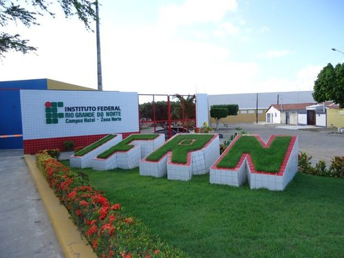

### Alunos:
- Alan César Rebouças de Araújo Carvalho
- Erick Henrique da Silva Paz
- Matheus Silva Mendes

---

## 🚀 Instalação

### 📦 Dependências

| Biblioteca | Uso |
|---|---|
| `osmnx` | Download e modelagem da rede viária via OpenStreetMap |
| `networkx` | Construção e análise dos grafos |
| `matplotlib` | Visualização dos grafos e histogramas |
| `numpy` | Cálculo de percentis e estatísticas |

### 1. Clone o repositório

```bash
git clone https://github.com/kire-h/Trabalho2_ED2
cd Trabalho2_ED2
```

### 2. Instale as dependências Python

```bash
pip install osmnx networkx matplotlib numpy
```

> ⚠️ O notebook foi desenvolvido no **Google Colab**. Para rodar localmente, certifique-se de que as dependências acima estão instaladas no seu ambiente.

---

## ▶️ Como usar

### Google Colab (recomendado)

1. Faça upload do arquivo `Trabalho_ED2.ipynb` no Google Colab
2. Execute as células em ordem
3. Os grafos e arquivos `.graphml` serão gerados automaticamente

### Localmente

```bash
jupyter notebook Trabalho_ED2.ipynb
```

> ⚠️ A célula de instalação (`!pip install osmnx`) pode ser ignorada se as dependências já estiverem instaladas.

---

## 🖥️ Estrutura do Notebook

O notebook está organizado nas seguintes etapas:

1. **Download da rede viária** — extração do grafo do bairro Potengi via OSMnx
2. **Conversão do grafo** — transformação de MultiDiGraph em grafo não-direcionado simples
3. **Cálculo das métricas** — grau, betweenness, closeness e core number
4. **Visualizações** — mapas coloridos por centralidade e histogramas de distribuição
5. **Exportação** — salvamento do grafo em formato `.graphml` compatível com o Gephi


## 📁 Estrutura do repositório

```text
├── Trabalho_ED2.ipynb        # Notebook principal de análise
├── rede_urbana.graphml       # Grafo exportado com atributos (padrão NetworkX)
├── rede_urbana_2.graphml     # Grafo exportado compatível com Gephi
├── images                    # Pasta com as imagens utilizadas no README.md
└── README.md                 # Documentação principal do repositório
```
---

## 🔬 Abrindo no Gephi

1. Gere o arquivo `rede_urbana_2.graphml` rodando o notebook
2. Abra o Gephi
3. **File → Open** → selecione o arquivo `rede_urbana_2.graphml`
4. O grafo será carregado com os atributos de latitude, longitude, grau, betweenness, closeness e core number já tipados corretamente

> O notebook corrige automaticamente os tipos dos atributos no `.graphml` (double, int) para garantir compatibilidade total com o Gephi.

---

## Objetivos do Trabalho 


1. Modelar a malha viária do bairro Potengi (Natal/RN) como um grafo a partir de dados reais do OpenStreetMap
2. Calcular métricas de centralidade da rede, como Betweenness e Closeness Centrality, identificando os cruzamentos mais críticos para o fluxo urbano
3. Identificar os principais hubs da rede, ou seja, os nós com maior número de conexões
4. Aplicar a decomposição K-Core para encontrar o núcleo mais denso e bem conectado da malha viária
5. Visualizar as métricas calculadas diretamente sobre o mapa do bairro, com coloração por intensidade
6. Exportar o grafo no formato .graphml compatível com o Gephi para análises visuais avançadas

---

## 📈 Metodologia 

1. Extração da rede viária do bairro Potengi via OSMnx
2. Conversão do grafo original (MultiDiGraph direcionado) para um grafo não-direcionado simples, removendo arestas paralelas e laços para viabilizar as análises
3. Cálculo do grau de cada nó e plotagem da distribuição de grau da rede para compreender o perfil de conectividade dos cruzamentos
4. Identificação dos Top 10 Hubs — os cruzamentos com maior número de conexões diretas na malha viária
5. Cálculo da Betweenness Centrality ponderada pela distância real das vias (weight='length'), identificando os nós que funcionam como principais pontes de fluxo
6. Cálculo da Closeness Centrality também ponderada pela distância real, identificando os nós com melhor acesso ao restante da rede
7. Aplicação do algoritmo de K-Core para decompor a rede em subgrafos por densidade, extraindo o Main Core (subgrafo com o maior k possível)
8. Visualização das métricas sobre o mapa urbano real usando paletas de cores (inferno para Betweenness, plasma para Closeness)
9. Exportação do grafo enriquecido com todos os atributos calculados para o formato .graphml, com correção manual dos tipos de dados para compatibilidade com o Gephi

---

## Resultados Obtidos

### Grafo da região obtido

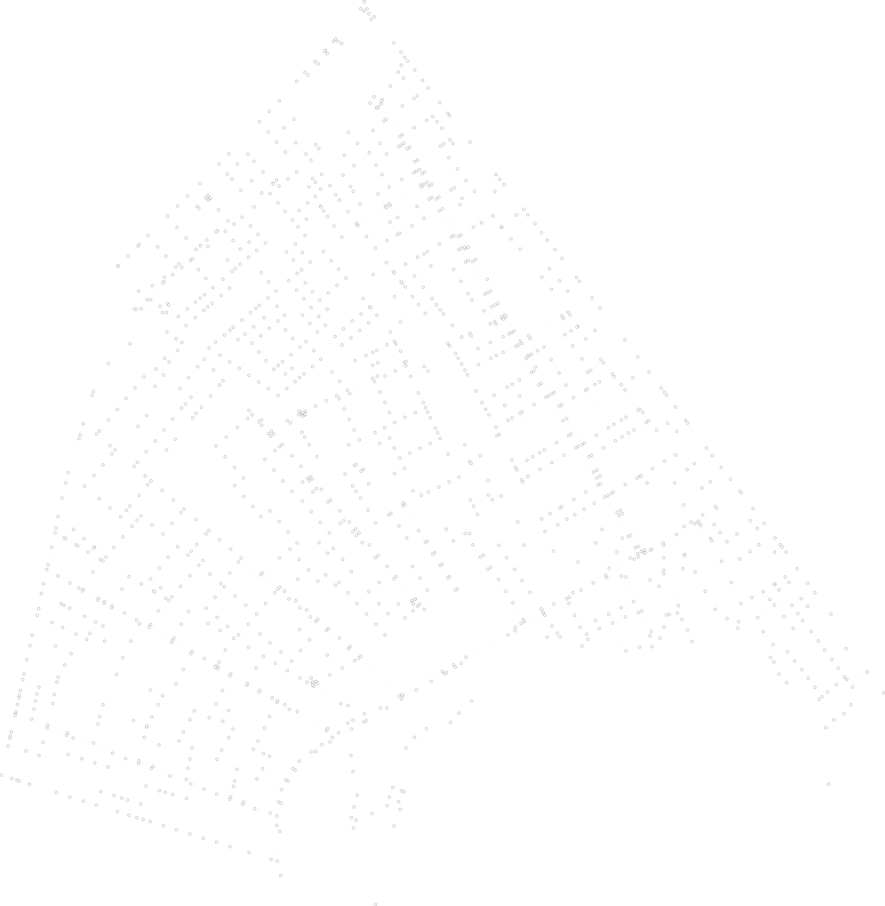

### Gráfico da distribuição por grau da rede


### Hubs

| ID do Nó | Grau |
| :--- | :---: |
| 558387303 | 5 |
| 9457010523 | 5 |


### Betweenness Centrality

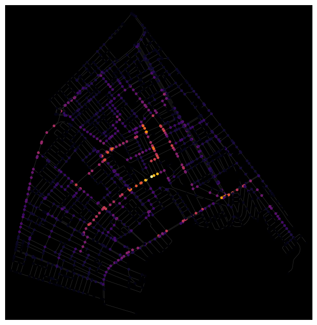

### Closeness Centrality 

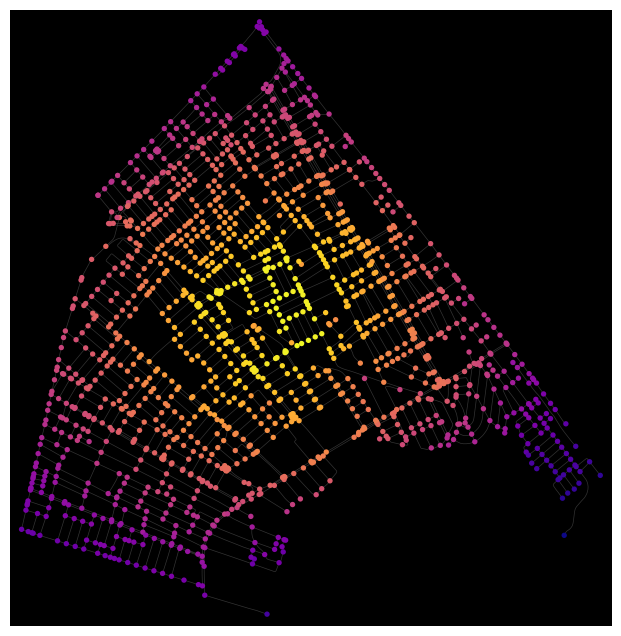

### Histograma das distribuições de Betweenness e Closeness


### Visualização dos Hubs e gargalos


### K-core

* **Maior valor de $k$-core encontrado:** 2
* **Total de nós no núcleo mais interno ($k=2$):** 1.399

## Visualização Geográfica

### Tamanho do nó proporcional ao grau e cor associada ao Core Number

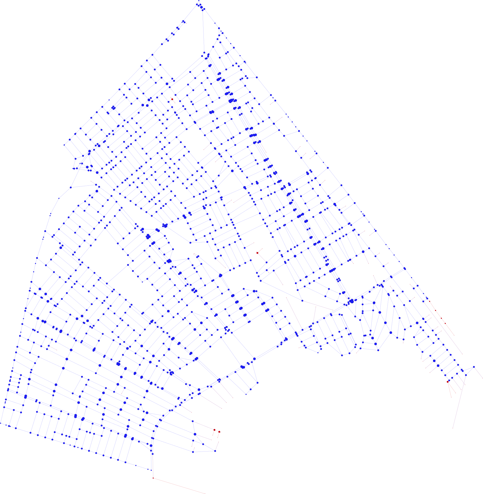

### Destaque dos nós com maior Betweenness

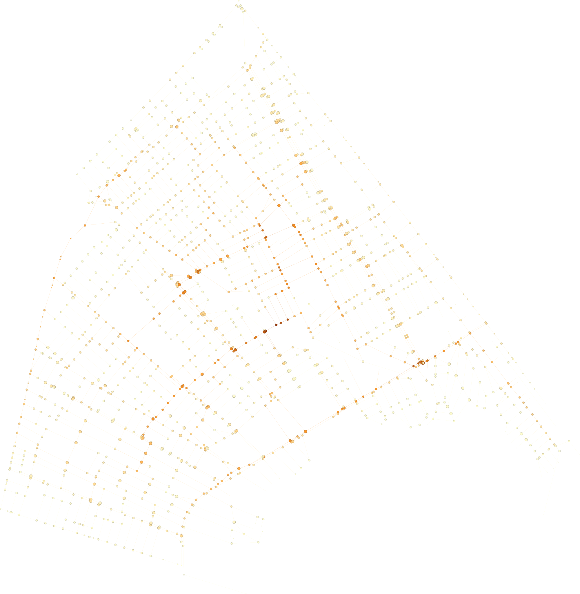

### K-core - Core number = 2

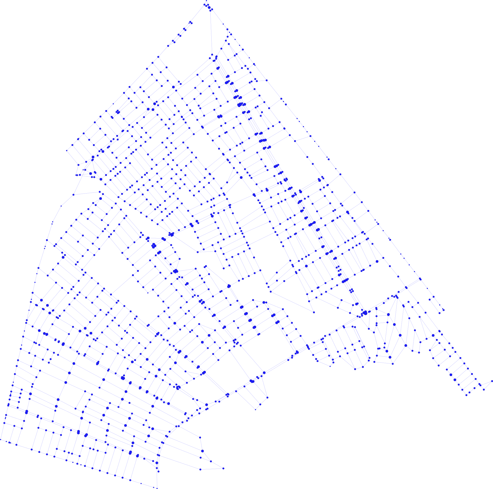

### Top 10% nós por grau

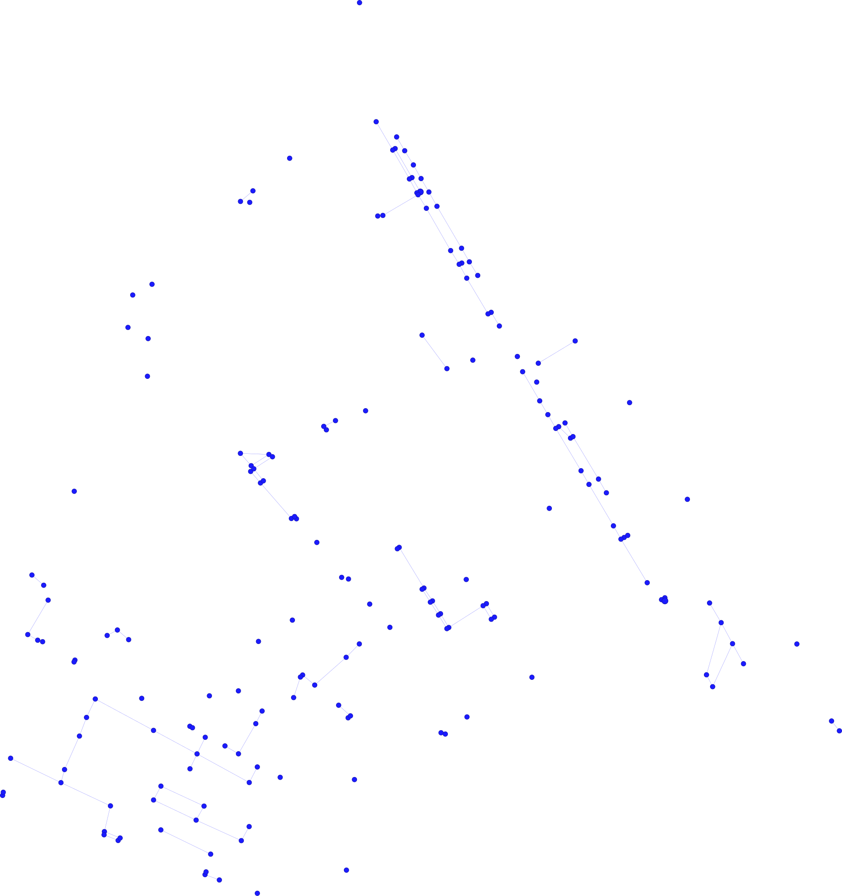

## Visualização estrutural

### Tamanho do nó proporcional ao grau e cor associada ao Core Number

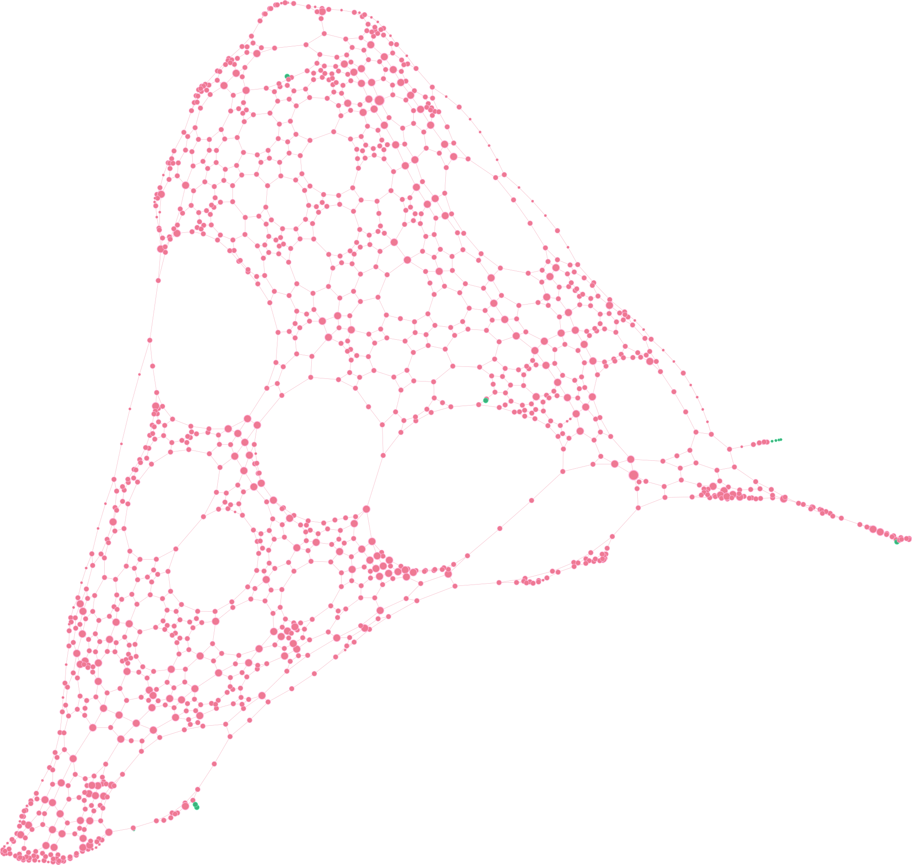

### Destaque dos nós com maior Betweenness

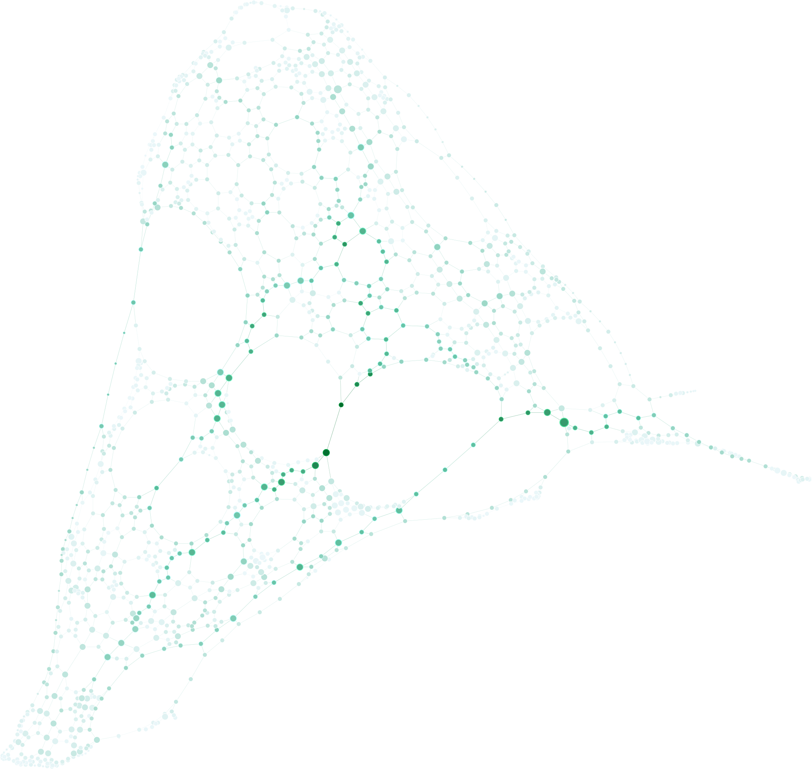

### K-core - Core number = 2

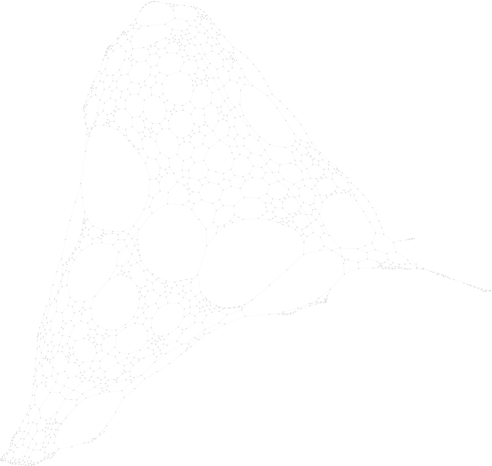

### Top 10% nós por grau

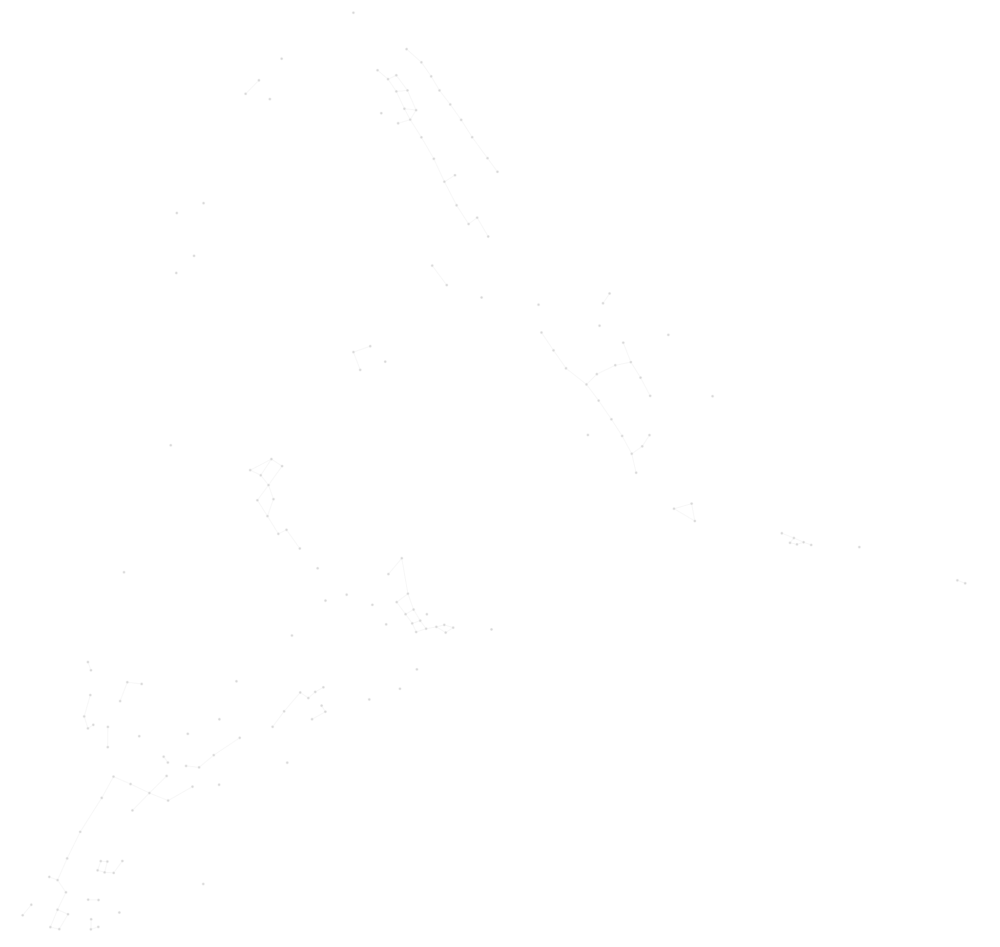

## Analise da visualização

Sobre o core number (cor):
* Geo Layout: azul (core 2), vermelho (core 1)
* Force Atlas2: rosa (core 2), verde (core 1)
* A rede é dominada por nós pertencentes ao core 2 — quase toda a rede forma um núcleo coeso e bem conectado
* Os nós do core 1 são raríssimos e aparecem nas bordas e extremidades da rede — são ruas com saída única, becos ou vias de acesso periférico
* Isso indica que o bairro de Potengi tem uma malha viária bastante integrada, sem muitas vias isoladas

Sobre o grau (tamanho):

* A maioria dos nós tem tamanho similar e pequeno — grau predominantemente baixo (2 ou 3 conexões por cruzamento)
* Nós maiores aparecem espalhados pela rede sem concentração clara em uma região específica — os cruzamentos mais conectados não formam um centro definido
* A parte superior da rede parece ter nós ligeiramente maiores, sugerindo uma área com cruzamentos mais complexos

Sobre o betweenness (cor):
* Geo Layout: laranja escuro (betweenness alto), amarelo claro (betweenness baixo)
* Force Atlas2: verde escuro (betweenness alto), verde claro/branco (betweenness baixo)
* Nós de alto betweenness são os cruzamentos que mais aparecem nos caminhos entre dois pontos quaisquer da rede
* Nós de baixo betweenness são cruzamentos locais, usados só por quem mora perto
* Os nós de alto betweenness formam corredores diagonais visíveis na rede — isso indica as vias principais do bairro, as que mais concentram fluxo de passagem

Distribuição espacial:

* Os nós de maior grau estão espalhados por todo o bairro — não há uma concentração central, o que confirma a homogeneidade da rede já observada antes
* As bordas do bairro também têm nós de alto grau, especialmente na região superior e direita — provavelmente onde há conexões com outros bairros
* Na visualização com force atlas2 é possivel ver espaços vazios, esses espaços representam grandes estruturas, como quadras ou escolas, forçando a rede a circundar a estrutura 

O que esses nós representam:

* São os cruzamentos mais complexos do bairro — onde mais ruas se encontram
* Mesmo sendo os top 10%, os nós parecem pequenos e uniformes — o que indica que a diferença de grau entre eles não é tão grande, a rede é realmente homogênea

## Análises dos resultados

### Os nós com maior grau coincidem com os nós de maior betweenness?

Os nós com maior grau não coincidem com os nós de maior betweenness (intermediação). Numa malha viária, o grau de um nó é limitado pela geometria física das esquinas (quase todos os cruzamentos têm apenas 3 ou 4 conexões directas), gerando centenas de nós empatados com o mesmo grau máximo. Em contrapartida, a centralidade de betweenness destaca a importância macroscópica e estrutural do nó na cidade, identificando pontes, viadutos ou avenidas principais que canalizam o tráfego global e funcionam como caminhos mais curtos entre diferentes bairros, independentemente de terem muitas ou poucas ruas conectadas directamente a eles.

### O núcleo identificado pelo k-core coincide com os principais hubs?

o núcleo identificado pelo k-core não coincide com os principais hubs. Nesta rede, os maiores hubs são nós isolados com grau 4 ou ligeiramente maior, correspondendo a rotatórias de grande porte ou cruzamentos complexos dispersos (muitos deles localizados em rodovias de acesso ou na periferia, onde o desenho das vias converge para poucos pontos). Por outro lado, como os nós de uma malha urbana possuem uma limitação física de conexões diretas por causa da geometria das ruas, a decomposição em 2-core elimina progressivamente essas ramificações periféricas e os hubs isolados. O núcleo resultante (o max core) se concentra na região com a malha viária mais densa, compacta e intensamente quadriculada do mapa — tipicamente áreas centrais e comerciais consolidadas, onde os nós formam um bloco altamente resiliente e interconectado, mesmo que individualmente cada cruzamento ali dentro tenha poucas vias conectadas a ele.

### O que a métrica de betweenness revela que o grau não revela?

Para este grafo específico do Potengi, o grau falha completamente em diferenciar a relevância das vias porque atribui exatamente o mesmo peso a uma esquina residencial interna e a um eixo logístico vital. Por exemplo, um cruzamento comum de 4 esquinas nas ruas residenciais internas do conjunto Santarém ou do Soledade terá grau=4, exatamente o mesmo grau de um nó crucial nas alças de acesso que conectam o fluxo interno do bairro à Avenida João Medeiros Filho (RN-160). O grau olha apenas para o número de ruas que chegam ao nó no nível micro, tratando uma rua sem saída e um corredor de transporte de massa como geometricamente idênticos.

A métrica de betweenness, por outro lado, revela a dependência estrutural do fluxo e os verdadeiros gargalos do Potengi, algo que fica nitidamente claro ao analisar o contraste entre as duas imagens. No layout geográfico, as vias parecem distribuídas de forma homogênea, mas o betweenness arranca essa máscara e, no layout estrutural, violenta e magneticamente puxa os nós centrais da Avenida João Medeiros Filho e das aproximações da Avenida Itapetinga para o centro absoluto do grafo. Essa métrica revela que esses pontos específicos funcionam como pontes e cordões umbilicais obrigatórios: eles canalizam os caminhos mais curtos que conectam os subconjuntos residenciais periféricos (que o layout estrutural joga para as margens) às saídas estratégicas em direção às pontes de Igapó e Newton Navarro. O betweenness revela, portanto, quais nós colapsariam e isolariam o Potengi do restante de Natal caso fossem bloqueados, enquanto o grau esconde essa vulnerabilidade sob a aparente igualdade de cruzamentos com 3 ou 4 conexões.

### O que muda quando a rede é analisada em sua posição geográfica real e quando é analisada por um layout estrutural?

A mudança entre a visualização geográfica real e o layout estrutural altera completamente a nossa percepção sobre o papel socioespacial de cada bairro e infraestrutura viária:

No layout geográfico real, a rede é rigidamente ditada pelo mapa físico, espelhando a disposição das ruas paralelas e os limites territoriais do Potengi. Essa visualização esconde o verdadeiro peso das vias principais, pois grandes avenidas parecem apenas linhas longas que ocupam espaço, enquanto as áreas residenciais periféricas e os conjuntos mais distantes parecem isolados ou desconectados do funcionamento geral do bairro.

Já no layout estrutural, a geometria física é ignorada e a rede é rearranjada puramente pela conectividade (topologia). Ao mesmo tempo, os tecidos urbanos densamente quadriculados (como o interior do conjunto Santarém) colapsam em aglomerados compactos devido à sua alta conectividade interna (k-core elevado), enquanto as ruas sem saída e os conjuntos residenciais mais isolados são jogados para as margens do grafo, desmascarando a desigualdade na infraestrutura de mobilidade do bairro.

### Existem regiões críticas para mobilidade urbana na área analisada?

A principal região crítica para a mobilidade na área estudada concentra-se no corredor estrutural da Avenida Doutor João Medeiros Filho (RN-302). Por se tratar de uma via arterial primária de alta capacidade, ela centraliza a maior parte do fluxo regional, convertendo-se em um gargalo estrutural. Suas interseções semafóricas e a conexão com importantes eixos secundários (como as Avenidas Maranguape, Rio Doce e Doutor José Francisco da Silva) geram pontos de retenção crônica, onde qualquer perturbação no tráfego provoca um efeito em cadeia imediato na acessibilidade das vias residenciais adjacentes.

### A rede parece homogênea ou apresenta concentração estrutural?

A malha urbana analisada é fortemente heterogênea e apresenta uma clara concentração estrutural. Em vez de uma distribuição equilibrada do fluxo, a rede depende de um padrão radiocêntrico e linear focado no eixo da Avenida Doutor João Medeiros Filho. Essa via primária e suas principais conexões atuam como verdadeiros "funis" de tráfego, concentrando os maiores índices de centralidade e conectividade regional. Enquanto a maior parte da rede é composta por ruas secundárias e locais de baixa capacidade, a mobilidade global do sistema fica vulnerável e altamente dependente de um número restrito de corredores estruturais.

### Os resultados obtidos fazem sentido considerando o conhecimento urbano da região escolhida?

Sim, os resultados fazem total sentido e refletem com precisão a realidade do bairro Potengi na zona norte de Natal. O eixo modelado da Avenida Doutor João Medeiros Filho (RN-302) é, de fato, uma importante via de tráfego da região, conectando a zona norte de natal, que é predominantemente mais residencial, à Ponte Newton Navarro e a Ponte de Igapó e ao restante da cidade. A identificação de forte concentração estrutural no modelo coincide com o histórico problema de isolamento e dependência dessa via única para o deslocamento diário da população, validando o grafo como uma representação fiel dos gargalos e da vulnerabilidade na infraestrutura de mobilidade local.

---

## Principais Conclusões Obtidas

Com base no cálculo das métricas de redes complexas e na comparação entre as visualizações geográficas e estruturais, destacam-se as seguintes conclusões sobre a malha viária do bairro Potengi:

* **A métrica de Grau é insuficiente para vias urbanas:** Devido às restrições geométricas das ruas (cruzamentos de 3 ou 4 vias), o Grau falha em diferenciar ruas residenciais sem saída de grandes avenidas. Para análises de tráfego, a **Betweenness Centrality** (Intermediação) mostrou-se a métrica definitiva para encontrar os verdadeiros gargalos estruturais.
* **Forte dependência de corredores arteriais:** A rede apresenta uma clara concentração estrutural no eixo da **Avenida Doutor João Medeiros Filho (RN-302)** e suas aproximações. Esses nós funcionam como "funis" obrigatórios que canalizam praticamente todo o fluxo de saída e entrada do bairro.
* **Fidelidade do modelo à realidade:** O grafo gerado a partir do OpenStreetMap validou matematicamente o conhecimento empírico diário dos moradores da Zona Norte. O modelo conseguiu diagnosticar com precisão a dependência histórica de poucas vias primárias e a vulnerabilidade da região a congestionamentos em seus pontos de estrangulamento.
